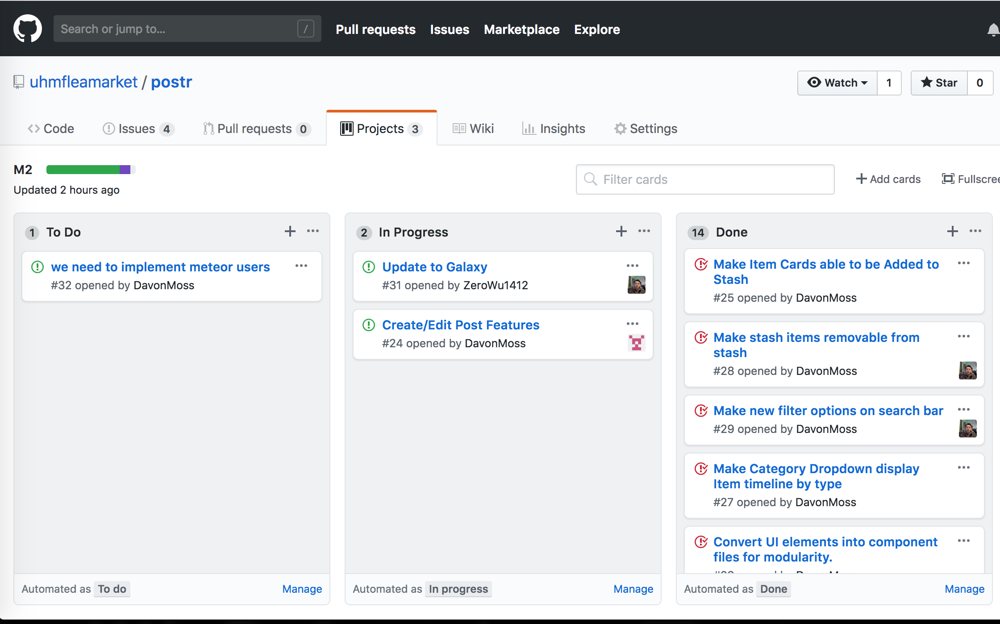

# Table of Contents
* [Overview](#overview)
* [About UHM Flea Market](#about-uhm-flea-market) 
* [User Guided](#user-guided) 
* [Developer Guide](#developer-guide)
* [Development History](#development-history) 
  * [Milestone 1](#milestone-1)
  * [Milestone 2](#milestone-2)
  * [Milestone 3](#milestone-3)
* [The Team](#the-team)
  * [Austin Haigh](#austin-haigh)
  * [Jiayu Xu](#jiayu-xu)
  * [Zero Wu](#zero-wu)
  * [William Cole](#william-cole)
  * [Davon Moss](#davon-moss)
* [Big Picture Vision](#big-picture-vision)

# Overview

Many college campuses have a very active second hand market, and UH Manoa is no exception. College students try to stretch their limited income by buying used goods and by selling things they no longer need. Previously, students used websites and apps such as Facebook Marketplace, Craigslist, and Letgo, but they are open to the general public which can lead to problems such as scams, robberies, and general inconvienence. Now, with our app they will have a place to trade with other UH Manoa students. Students can feel safe knowing they aren't dealing with an anonymous (and potentially criminal) stranger, and they can meet eachother between classes instead of trying to meet someone half way across town.

# About UHM Flea Market

The UHM Flea Market is a Meteor application that will offer UHM students a chance to buy and sell everyday college needs, safely.

- Have students login with their UH credentials to access the system
- Connect buyers and sellers through UH credentials
- Items and services offered on this site will be geared specifically towards UHM students
images

# User Guide
[Here](https://uhm-flea-market.meteorapp.com/) a demo of the UHM Flea Market

You will be greeted by the following landing page: 


Once you logged in, you will be redirected to a login page where you must use your UH username and password:


After logged in, users will be directed to the Home Page where user able to view items, cost, seller, and item condition:


By clicking into the selected items, user will be able to view the items and seller in details. 


Directed from the Home Page, user able to view its profile, meeting history, past post, creating new post, and contact admin. 


By clicking on the Messages button in the top right of several of the pages, you reach a DM feature with other users.


# Developer Guide

1. install [Meteor](https://www.meteor.com/install).

2. Download a copy of The UHM Flea Market, or clone it using github.
  
3. cd into the app directory with:
```
$ cd app
```
4. Install libraries with:

```
$ meteor npm install
```

5. Run the system with:

```
$ meteor npm run start
```

The application will appear at [http://localhost:3000](http://localhost:3000).

# Development History

The development process for the UHM Flea market follows the [Final Project](http://courses.ics.hawaii.edu/ics314s17/morea/project-management/reading-screencast-idpm.html). The development consists of a sequence of Milestones that consist of issues corresponding to the tasks. GitHub projects are used to manage the processing of tasks during a milestone.  

The following sections document the development history of the UHM Flea Market.

## Milestone 1: Mockup Development and Authentication

Milestone 1 started on Nov 5, 2018 and completed Nov 15, 2018. 

The goal of Milestone 1 is to combine all of the groups idea developed during our own mockup of this project and combine these pages to create an application that is uniform in looks and has the links to the other pages. These pages will be developed as a Meteor app and will be implemented in order to get the routing to the other pages to work.

Mockups for the following pages were implemented during M1:


Milestone 1 was implemented as [UHM Flea Market Github Milestone 1](https://github.com/uhmfleamarket/postr/projects/1):


Milestone 1 consisted of 6 issues, and progress was managed via the [M1](https://github.com/uhmfleamarket/postr/issues):


Each issue was implemented in its own branch, and merged into full-site-test-merge when completed:


## Milestone 2: Data Model Development

Milestone 2 started on Nov 15, 2018 to ended Nov 27, 2018.

The goal of Milestone 2 is to start working on the application's functionality by implementing the data model. 

Mockups for the following pages were implemented during M2:


Milestone 2 was implemented as [UHM Flea Market Github Milestone 2](https://github.com/uhmfleamarket/postr/projects/2):


Milestone 2 consisted of 11 issues and progress was managed through [Manoa Flea Market Github Milestone 2](https://github.com/uhmfleamarket/postr/issues):


Each issue was implemented in its own branch, and merged into master when completed:



## Milestone 3

Milestone 3 started on Nov 28, 2018 and ended Dec 6, 2018.

The goal of Milestone 3 was to completet all the applications functionality and the appearance of the application. 

Milestone 3 was implemented as [UHM Flea Market Github Milestone 3](https://github.com/uhmfleamarket/postr/projects/3):


# The Team

## Austin Haigh
My goal for this project, apart from getting a good grade in this class, is mainly to finish another project that I can put on my resume. I'm best at backend development and have a few years of experience with Javascript. I hope to develop better team collaboration skills during this project.

## Jiayu Xu
My goal for this project is to have fun and create something that is interesting and useful. I want to apply the skills I learned so far in 311 into creating something amazing. I want the finished product to be attractive and easy to use. Payment system should be seamless and effective. Ebay, Craigslist, Letgo, is kind of ugly and complicated. The goal is to link sellers and vendors together hasslefree.I also want to create a effective escrow/ payment system to enable this. In general e-commerce is kind of clunky. We want to make peer to peer commerce more attractive. We want vendors and buyers to be ranked based on their performance.

## Zero Wu
My personal goal for this project is to have to get more experience on application creation. I find these experiences to be very useful in the field and it a good presentation to shows what I have work on and skill. Making selling produce page have become a very common in the modern day, it will be useful when I want to create my own product page in the future.

## William Cole
My personal goal for this project is to gain confidence building an application, and feel more confident as a "software developer".

## Davon Moss
My goal for this project is to experience working with a team to reach a finished product, so that I can bring that knowledge to the job market. I am mostly interested in developing the front-end of the application, and ensuring that our app is well desined and intuitive. I hope to learn more from my teammates about back-end and database design. 

# Big Picture Vision
Hopefully, tradr will become a useful and convenient tool for students looking to optimize their college experience. Tradr could even be extended past the UHM campus and become an application that is implemented across multiple campuses nationwide.
